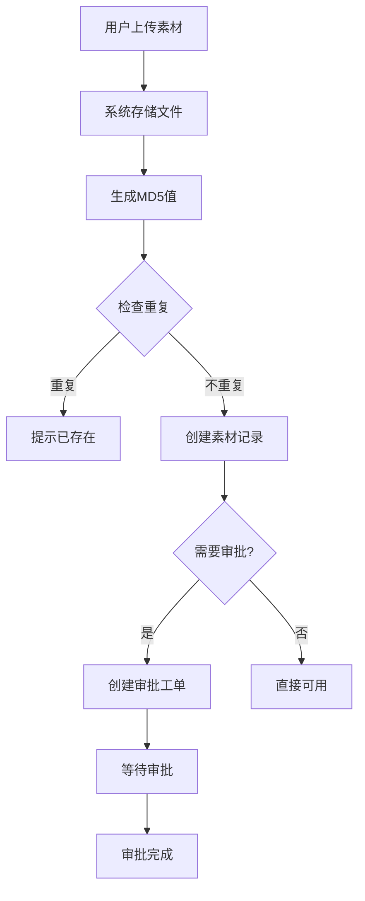
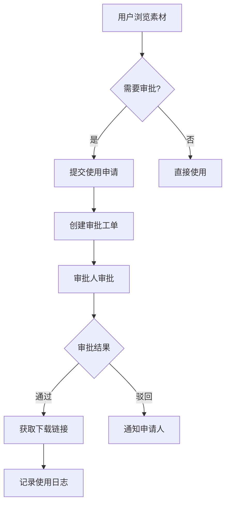

# 宣传教育平台 - 产品需求文档

## 文档信息

| 项目 | 说明 |
|------|------|
| 项目名称 | 宣传教育平台 |
| 文档版本 | v1.0 |
| 最后更新 | 2024-01-09 |

---

## 1. 产品概述

### 1.1 产品定位

宣传教育平台是一个企业级的素材资产管理系统，旨在解决企业内部素材的统一管理、审批流转和使用追踪问题。

### 1.2 目标用户类型

- **普通用户**：需要上传素材、申请使用素材的员工
- **审批员**：负责审批素材上传和使用申请的管理人员
- **管理员**：负责系统配置、用户管理、流程设计的管理者

### 1.3 核心价值

- 统一管理企业素材资产
- 规范审批流程
- 追溯素材使用记录
- 提高协作效率

---

## 2. 功能需求

### 2.1 素材管理

#### 2.1.1 功能概述

提供素材的全生命周期管理，包括上传、查看、审批、使用等环节。

#### 2.1.2 功能列表

| 功能 | 描述 | 优先级 |
|------|------|--------|
| 素材上传 | 支持上传视频、图片、文档三类素材 | P0 |
| 文件存储 | 支持本地文件存储，可扩展云存储 | P0 |
| 去重检测 | 通过MD5值检测重复素材，避免重复存储 | P1 |
| 素材预览 | 支持图片缩略图预览、视频在线播放 | P0 |
| 素材搜索 | 支持按名称、类型、状态筛选搜索素材 | P0 |
| 素材删除 | 支持删除无用素材 | P1 |
| 版权管理 | 记录素材版权信息 | P2 |

#### 2.1.3 素材类型

支持以下三种素材类型：

| 类型 | 说明 | 常见格式 |
|------|------|----------|
| 视频 | 各类视频文件 | mp4, avi, mov等 |
| 图片 | 各类图片文件 | jpg, png, gif等 |
| 文档 | 各类文档文件 | pdf, doc, docx等 |

#### 2.1.4 素材状态

素材具有以下状态流转：

| 状态 | 说明 | 前置条件 |
|------|------|----------|
| 草稿 | 素材刚上传，等待审批 | 上传素材 |
| 待审 | 素材进入审批流程 | 提交审批 |
| 可用 | 素材审批通过，可正常使用 | 审批通过 |
| 锁定 | 素材被锁定，暂时不可用 | 管理员锁定 |

---

### 2.2 审批流程管理（分层架构版）

#### 2.2.1 功能概述

提供灵活可配置的审批工作流引擎，支持可视化流程设计。系统采用**“层级顺序 + 层内并行”**的标准化模型：任何审批流程都由一个或多个“审批层”串联组成，层级之间严格按顺序流转，层级内部支持多名审批人同时处理。

#### 2.2.2 功能列表

| 功能 | 描述 | 优先级 |
| :--- | :--- | :--- |
| **流程定义** | 创建和管理基于“层级架构”的审批流程模板 | P0 |
| **可视化设计器** | 拖拽式设计审批层级轨道，支持可视化配置流转逻辑 | P0 |
| **流程版本管理** | 支持流程版本升级和历史版本查看 | P1 |
| **流程启用/禁用** | 控制流程的可用状态 | P0 |
| **内置模板** | 提供常用审批流程模板（如：分层财务审批、行政审批） | P1 |

#### 2.2.3 流程逻辑定义

系统遵循以下核心处理逻辑，确保流程流转的严谨性：

* **串行流转（层间）：** 流程必须完成第 $N$ 层的全部审批逻辑，方可进入第 $N+1$ 层。
* **并行处理（层内）：** 进入某一层后，该层内所有审批人同时收到待办任务，不分先后顺序。
* **层级自动跳过：** 若某层级通过逻辑计算（如条件过滤）后无有效审批人，系统将自动进入下一层，避免流程阻塞。

#### 2.2.4 核心组件：审批层 (Stage)

系统不再直接在画布上连接孤立的审批节点，而是配置“审批层”作为基本流转单元：

| 组件名称 | 描述 | 核心配置项 |
| :--- | :--- | :--- |
| **审批层 (Stage)** | 流程的最小流转阶段 | 层名称、层准入条件 |
| **层内成员** | 该层包含的所有审批个体 | 指定人员、角色、部门或组织架构变量 |
| **层内规则** | 决定该层何时通过 | 或签（一人过即全层过）、会签（全员过）|

#### 2.2.5 节点类型

可视化设计器通过以下节点串联“审批层”：

| 节点类型 | 说明 |
| :--- | :--- |
| **开始节点** | 流程的起点 |
| **审批层节点** | 承载具体审批人员与层内规则的核心单元 |
| **条件节点** | 根据表单字段判断流程走向哪些审批层 |
| **结束节点** | 流程的终点 |

#### 2.2.6 审批人配置

每个审批层内部支持配置以下成员类型：

| 审批人类型 | 说明 |
| :--- | :--- |
| **指定用户** | 指定具体某个用户 |
| **指定角色** | 该角色下的所有用户（进入该层后同时收到待办） |
| **指定部门** | 该部门下的所有用户 |
| **发起人自己** | 由发起人确认（常用于首层自查场景） |

#### 2.2.7 审批执行逻辑细化

为了满足“分层顺序”的需求，执行引擎遵循以下规则：

* **进入下一层：** 仅当当前层满足“层内规则”（如：会签 100% 通过）后触发。
    * *示例：* 第一层部门负责人审批完，才轮到第二层总监审批。
* **层内撤回：** 在当前层未完成前，发起人可撤回；一旦进入下一层，仅支持“驳回”操作。
* **驳回处理：**
    * **默认逻辑：** 驳回至流程发起人。
    * **高级逻辑：** 驳回至上一个审批层（逐层回退），避免流程完全重走。

#### 2.2.8 分层场景示例

以“**重大采购申请**”为例，其逻辑结构如下：

1.  **第一层：业务确认（串行第一步）**
    * **成员：** 项目组 A 负责人、项目组 B 负责人（并行处理）
    * **规则：** 会签（所有负责人必须知晓并同意）
2.  **第二层：职能审核（串行第二步）**
    * **成员：** 财务部、法务部（并行处理）
    * **规则：** 或签（任一部门初审通过即可）
3.  **第三层：终审（串行最后一步）**
    * **成员：** 总经理
    * **规则：** 单人审批通过

---

## 3. 非功能性需求

### 3.1 性能需求

| 指标 | 要求 |
|------|------|
| 响应时间 | 页面加载时间不超过2秒 |
| 并发用户 | 支持100个并发用户 |
| 文件上传 | 支持最大100MB单文件上传 |
| 数据量 | 支持10万+素材数据 |

### 3.2 安全需求

| 需求项 | 说明 |
|--------|------|
| 用户认证 | 需要登录才能使用系统 |
| 权限控制 | 不同角色拥有不同权限 |
| 数据加密 | 敏感数据加密存储 |
| 审计日志 | 记录关键操作日志 |

### 3.3 兼容性需求

| 类别 | 要求 |
|------|------|
| 浏览器 | Chrome、Firefox、Edge最新版本 |
| 操作系统 | Windows、macOS、Linux |
| 移动端 | 响应式设计，支持移动浏览器 |

### 3.4 可用性需求

| 需求项 | 说明 |
|--------|------|
| 界面友好 | 简洁直观的用户界面 |
| 操作便捷 | 减少操作步骤，提高效率 |
| 错误提示 | 清晰的错误提示信息 |
| 帮助文档 | 提供操作说明文档 |

---

## 4. 业务流程

### 4.1 素材上传流程

### 4.2 素材使用流程

### 4.3 审批流程执行

见上述需求

---

## 5. 界面需求

### 5.1 主要页面

| 页面 | 描述 | 主要功能 |
|------|------|----------|
| 登录页 | 用户登录入口 | 用户名密码登录 |
| 素材管理页 | 素材列表和操作 | 上传、搜索、查看、删除 |
| 审批工单页 | 工单列表和审批 | 待审批、我的工单 |
| 流程列表页 | 审批流程管理 | 查看、启用、禁用流程 |
| 流程设计器 | 可视化流程设计 | 拖拽设计流程图 |
| 使用日志页 | 日志查询统计 | 查看操作记录 |

创建审批流程的前端引导：
Vue 前端设计提示
为了实现上述“分层顺序、层内并行”的需求，建议前端采用以下设计方案：

1. 视图布局建议
线性垂直布局：不同于传统的自由拓扑图，建议采用类似“时间轴”或“步骤条”的垂直布局。每个“审批层”作为一个大的卡片容器。

拖拽交互：使用 vuedraggable 实现层级卡片（Stage）之间的上下排序，确保“层间顺序”的可操作性。

2. 组件架构
WorkflowEditor.vue：主画布，管理一个由 stages 组成的数组。

StageContainer.vue：层级卡片组件，内部渲染 ApproverTag（审批人标签）列表。

ApproverSelector.vue：人员选择弹窗。

ConfigPanel.vue：右侧抽屉，点击某个 Stage 时，配置该层的“会签/或签”属性。

### 5.2 界面设计原则

- 简洁明了，减少用户学习成本
- 操作便捷，常用功能一键可达
- 信息清晰，重要信息突出显示
- 响应式设计，适配不同屏幕

---

## 6. 数据需求

### 6.1 核心数据实体

| 实体 | 说明 | 关键属性 |
|------|------|----------|
| 用户 | 系统用户信息 | 用户名、姓名、角色、部门 |
| 素材 | 素材文件信息 | 名称、类型、状态、文件路径 |
| 审批流程 | 流程定义信息 | 流程名称、版本、定义内容 |
| 审批实例 | 流程执行实例 | 关联流程、状态、当前节点 |
| 审批任务 | 待办任务信息 | 关联实例、审批人、状态 |
| 审批工单 | 兼容旧版工单 | 业务类型、状态、关联素材 |
| 审批记录 | 审批历史记录 | 审批人、操作、意见 |
| 使用日志 | 素材使用记录 | 操作人、操作类型、时间 |
| 部门 | 组织部门信息 | 部门名称、父部门、负责人 |
| 角色 | 角色信息 | 角色名称、权限描述 |

### 6.2 数据关系

- 用户归属于部门，用户拥有角色
- 素材关联上传用户
- 审批流程产生审批实例
- 审批实例包含多个审批任务
- 审批任务产生审批记录
- 使用日志关联素材和操作用户

---

## 7. 系统约束

### 7.1 技术约束

- 需要支持主流浏览器
- 需要稳定的网络环境
- 需要数据库持久化存储

### 7.2 业务约束

- 素材必须经过审批才能使用（除非流程设置为无需审批）
- 审批工单只能由指定审批人处理
- 已使用的素材不能被删除（只能标记为不可用）
- 同一MD5的素材不重复存储

### 7.3 合规约束

- 需要记录完整的操作日志
- 需要保护用户隐私数据
- 需要确保数据安全存储

---

## 8. 未来规划

### 8.1 短期规划

- [ ] 支持云存储（OSS）
- [ ] 支持批量操作
- [ ] 优化大文件上传体验
- [ ] 增加素材标签功能

### 8.2 中期规划

- [ ] 移动端App支持
- [ ] 素材分享功能
- [ ] 素材收藏功能
- [ ] 智能推荐素材

### 8.3 长期规划

- [ ] AI自动审核
- [ ] 素材智能分类
- [ ] 数据分析报表
- [ ] 与其他系统集成

---

## 9. 附录

### 9.1 术语表

| 术语 | 解释 |
|------|------|
| 素材 | 系统中管理的各类媒体文件资源 |
| 工单 | 审批流程中的业务单据 |
| 流程实例 | 流程定义的一次执行 |
| 待办任务 | 等待处理的审批任务 |
| 会签 | 所有人都必须审批通过 |
| 或签 | 任一人审批通过即可 |

### 9.2 变更记录

| 版本 | 日期 | 变更内容 | 变更人 |
|------|------|----------|--------|
| v1.0 | 2024-01-09 | 初始版本创建 | - |

---

**文档结束**
